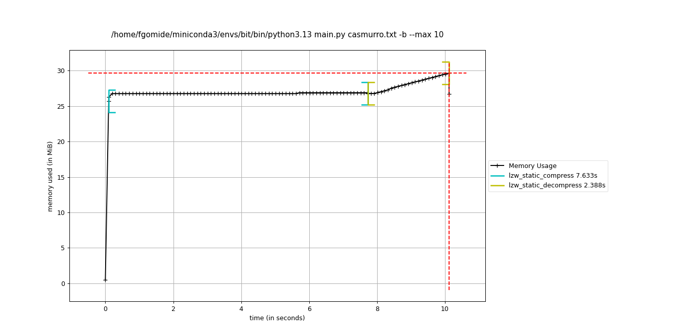

# ALG2-LZW

Este é um trabalho prático da disciplina de Algoritmos II, do curso de graduação em Ciência da Computação da UFMG.

## Alunos envolvidos:
### Cecília Junqueira Vieira Machado Pereira - 2022094888 [[@cecijunq](https://github.com/cecijunq)]
### Felipe Lopes Gomide - 2022043213 [[@FelipeGomide](https://github.com/FelipeGomide)]


# 1. INTRODUÇÃO

No Trabalho Prático 1 proposto, foi solicitado a implementação do método Lempel-Ziv-Welch (LZW), cujo principal objetivo é realizar a compressão e a descompressão de arquivos. Esse método consiste em armazenar as sub-cadeias lidas em um dicionário e, a cada sub-cadeia, atribui-se um código correspondente que será usado para representar a sub-cadeia de maneira mais comprimida. Mas, ao ler uma sub-cadeia, sempre checa primeiro se essa sequência já foi lida previamente e, caso tenha sido, escreve o código associado à sequência. Caso contrário, insere a nova sub-cadeia no dicionário e atribui um novo código a ela.

O diferencial da implementação proposta nesse trabalho é que o dicionário que armazena as sub-cadeias deve ser representado como uma Trie de Prefixos Compacta Binária, conteúdo que foi estudado em sala de aula. A seguir, será explicado como foi feita a implementação do trabalho e as estruturas de dados que o compõem.

# 2. DETALHES DA IMPLEMENTAÇÃO

## 2.1. Implementação da Trie

Essa estrutura foi implementada a partir da criação das classes `Node` e `Trie`. A classe `Node` é responsável por armazenar os dados correspondentes a cada nó que compõe a trie. Os dados armazenados são:
- A substring armazenada no nó em questão (string binária).
- Um dado do tipo `bool` que indica se aquele nó é folha ou não.
- Um dado do tipo inteiro que armazena o código (se o nó for folha).
- Três ponteiros para filhos: o filho à esquerda, o à direita e o filho que armazena ε (indica que o nó corrente armazena uma cadeia inserida na trie). O filho à esquerda armazena apenas as sub-cadeias que começam com zero e o à direita, as que começam com um.

### 2.1.1. Inserção na Trie

A estrutura de dados responsável por armazenar o nó da árvore é representado pela classe "Trie", cujo construtor cria o nó da raiz, que armazena uma string vazia e as cadeias inseridas no dicionário são inseridas como filhas desse nó raiz. Após criar a raiz, a inserção é feita através da função "insert" da classe "Trie" que chama a função "insert_search" de "Node", na qual passa-se a string como parâmetro (que é a que será inserida na árvore ). 
		A primeira tarefa realizada é verificar qual o maior prefixo comum entre a string que deseja adicionar na trie e a chave armazenada no nó 'n' que chama essa função. Se o prefixo for igual à string armazenada em 'n', deve-se adicionar o sufixo restante da chave que deseja adicionar como filho à esquerda do nó n (se o sufixo começa com zero) ou como filho à direita de n (se o sufixo começa com um). Caso contrário, deverá modificar o valor armazenado no nó 'n', para adicionar a nova chave na trie.
		Há quatro possibilidades de inserção da nova chave:
  
   - **Caso 1:** Chave do nó pai é igual ao texto inserido. Define que o ramo "epsilon_child" apontará para um novo nó que será criado e que armazenará uma cadeia vazia. Além disso, define que o nó pai (que recebeu a inserção) não é mais folha).
   - **Caso 2:** Cadeia que será inserida no nó é maior do que a cadeia armazenada no nó pai. O nó que armazena o sufixo da cadeia a ser inserida deverá será definido como filho à esquerda, se o primeiro elemento dessa sub-cadeia for zero, ou como filho à direita, caso contrário.
   - **Caso 3:** A chave da cadeia a ser inserido é prefixo do valor armazenado no nó pai dessa inserção. Deve-se adicionar o nó que armazena o epsilon (para indicar que inseriu a última cadeia) e deve adicionar o sufixo da cadeia do nó que se tornou o nó pai da subárvore originária dessa nova inserção como um novo filho dele. Mantém-se a lógica que será filho à esquerda se o primeiro elemento do sufixo for zero, mas será filho à direita, caso contrário.
   - **Caso 4:** Tanto a cadeia que está sendo inserida, quanto o valor armazenado no nó da sub-árvore em questão têm sufixos que não casam entre si. Assim, adiciona-se dois nós: entre os dois sufixos que não casaram, aquele que começa com zero é o filho da esquerda no nó pai da sub-árvore e o outro, que começa com um, é o filho à direita.

Além disso, é importante mencionar que cada cadeia inserida na trie é associada a um código que é armazenado no nó folha que indica o final da cadeia. Assim, ao inserir uma string no dicionário, deve-se passar não apenas a cadeia a ser inserida, como também o código.

### 2.1.2. Busca na Trie

Essa operação, implementada pela função `search` recebe como parâmetro a cadeia que se deseja buscar e, a partir do nó raiz da árvore completa, verifica se o texto armazenado no nó onde está é igual ao texto que está buscando. Se for, retorna `True` e o código associado ao nó onde está. Caso contrário, verifica qual dos filhos desse nó tem um valor que é prefixo da cadeia que se deseja inserir e se encontrar um filho que satisfaça isso deve mover para esse nó filho e chamar a função `search` recursivamente, mas, dessa vez, passando como parâmetro apenas o sufixo da cadeia que não casou com o valor armazenado no nó onde estava. Caso não encontre nenhum filho do nó onde está cujo valor armazenado seja prefixo do texto (que quer inserir passado como parâmetro à função, retorna-se `False`.

### 2.1.3. Remoção na Trie

A função `remove` realiza a remoção de uma cadeia passada como parâmetro a ela e o 0 primeiro passo é verificar se cadeia que deseja-se remover existe na árvore (usa-se o método "search" para verificar isso) e, se existir, prosseguimos com o processo de remoção.
	
Se o nó atual for uma folha, verifica se seu valor corresponde à string a ser removida; se sim, permite a remoção retornando True. Para nós internos, calcula-se o prefixo comum entre a string e o valor do nó. O sufixo restante determina o próximo passo: se vazio, o nó remove seu filho épsilon (caso exista) e verifica se deve combinar valores de filhos restantes ou transformar-se em folha. Caso o sufixo não seja vazio, delega a remoção ao filho correspondente (0 ou 1).

Após cada remoção, a função ajusta a trie para eliminar redundâncias. Se um nó tem apenas um filho restante, combina os valores para manter a compactação. A estrutura resultante permanece eficiente, com o menor número possível de nós, garantindo a integridade da trie após a remoção da string.

# 3. IMPLEMENTAÇÃO DO MÉTODO LZW

Nesse método, são executadas duas ações principais, que serão analisadas a seguir: a compressão e a descompressão de um arquivo.

## 3.1. Compressão no método LZW

O primeiro passo, após, obviamente, criar o dicionário que armazenará as cadeias lidas, é inserir todos os 256 unicodes e o respectivo código ASCII que será armazenado na folha Trie (que indica o fim da cadeia). 

Na nossa implementação, definimos que o texto que será comprimido será lido de um arquivo. Assim, após ler o arquivo a ser comprimido, obtém-se a sua representação correspondente em binário e, em seguida, lê-se o conteúdo de 8 em 8 bits,que serão inseridos no dicionário. 

Após ler cada byte, primeiro verifica se a última cadeia inserida na Trie, concatenada a essa nova cadeia lida, já foi inserida no dicionário (usa a operação "search" descrita anteriormente para verificar isso) e, se já tiver sido, adiciona o código associado a essa cadeia à string que armazena os códigos comprimidos. Caso contrário, insere a concatenação da última cadeia lida com a nova lida no dicionário e define que o código dessa cadeia é igual ao tamanho do dicionário (em seguida, soma 1 unidade à variável que armazena o tamanho dessa estrutura). Por fim, nesse último caso, deve-se atualizar qual foi a última cadeia lida. Após concluir a leitura do documento em binário, será retornada a string composta pela representação em código.

## 3.2. Descompressão no método LZW

Assim como na compressão, o primeiro passo é criar um dicionário que armazena os unicodes e os seus respectivos códigos ASCII. O dicionário construído na descompressão mapeia o código à string correspondente e, a cada código lido, concatena a string lida às lidas anteriormente. 

Após criar o dicionário, deve-se ler qual o primeiro código da compressão e a decodificá-lo. Como essa primeira leitura corresponde a um único caracter (sempre será assim), lê qual o código no arquivo comprimido e busca-o na Trie e insere a cadeia associada a ele na string de saída que armazena a decodificação. Para os códigos subsequentes, checa-se se o código lido já foi inserido no dicionário e, caso tenha sido, registra na string de saída o texto associado ao código. Caso contrário, concatena-se o último símbolo decodificado com o último byte lido que não pertencia à Trie e insere no dicionário de decodificação (e o código associado a ele corresponde ao tamanho do dicionário). Realiza esse processo até ler todos os códigos que compõe o arquivo comprimido. Ao final, será retornado a string de saída com o texto original.

## 3.3. Detalhes relevantes sobre a implementação das ações mencionadas acima

Conforme mencionado, é definido um número máximo de bits que podem ser usados para representar os códigos de cada cadeia, existindo a possibilidade de que tal limite seja atingido antes de acabar o processamento das cadeias. Diante dessa situação, há dois caminhos que podem ser tomados: pode-se manter o dicionário e para cada cadeia restante para ser processada e comprimida, a compressão delas deve ser feita de acordo com as cadeias já inseridas no dicionário. Outra opção é reiniciar o dicionário, mantendo apenas os unicodes e, a partir daí, adiciona as cadeias restantes (mas deve-se manter o que já foi comprimido antes). Essas duas implementações podem ser feitas tanto na abordagem de chaves de tamanhos em bits estático, quanto das de tamanho dinâmico.

# 4. ABORDAGENS DA REPRESENTAÇÃO DAS CADEIAS NO MÉTODO LZW

Foram implementadas duas formas como representar o código que é usado para realizar a compressão: o número de bits usado para representar o código por ser fixo ou pode ser dinâmico. 

## 4.1. Códigos cujos binários são de tamanho fixo

Os códigos são sempre escritos usando uma quantidade pré-definidas de bits, que é depende do tamanho máximo do dicionário. Caso tente inserir uma nova cadeia na árvore, mas todos os códigos no intervalo [0; tamanho dicionário] já foram atribuídos a outras cadeias, a inserção não poderá ser feita e a compressão só poderá ser realizada usando as chaves já inseridas no dicionário. Contudo, conforme mencionado na seção 3, há outra implementação possível, que é reiniciando o dicionário, conforme já foi explicado na seção 3.

## 4.2. Códigos cujos binários são de tamanho variável

Já na abordagem dinâmica, os tamanhos em bits para ser usado na representação dos códigos começa com um tamanho pré-definido de 8 bits (é o número de bits necessário para representar os códigos dos unicodes), mas, de acordo com a necessidade, pode-se usar mais bits para representar os códigos, à medida que insere novas cadeias na trie. Essa abordagem é mais vantajosa no que tange ao uso da memória, pois, como o aumento é feito de acordo com a necessidade, não há uso desnecessário de bits, logo, a compressão feita se torna mais eficiente. Mas, assim como na abordagem anterior, na dinâmica também há um número máximo de bits que pode ser usado para representar os códigos e, caso atinja esse máximo, não podem ser feitas novas inserções e, dessa forma, as compressões das novas cadeias lidas devem ser feitas usando as chaves já inseridas na Trie (ou seguindo o outro paradigma de reiniciar a Trie, como foi explicado na seção 3).

Essa ideia do número de bits usado ser fixa ou variável é aplicável tanto na construção do dicionário durante a compressão, quanto durante as descompressão, mas sempre respeitando o número de bits que pode ser usado para representar os códigos.

# 5. ORGANIZAÇÃO DOS ARQUIVOS E DIRETÓRIOS

A pasta `lzw` é onde está presente os arquivos que contém a implementação da Trie Compacta (mais especificamente, está em `./lzw/trie/binary_compact_trie.py`. 

Ainda no diretório `lzw` estão os arquivos `static.py` e `static_reset.py` que implementam a compressão e a descompressão com o código de tamanho estático. A diferença entre as duas está no fato que no `static_reset.py`, quando todas as chaves que podem ser representadas com o número de bits definidos já estão sendo usadas, reinicia-se o dicionário, adiciona apenas os unicodes (e seus respectivos códigos) e, a partir daí, insere as chaves restantes. Já no `static.py`, quando ao usar todos os códigos possíveis, mantém-se o dicionário obtido e apenas comprimi as novas sub-cadeias de acordo com as chaves que já foram inseridas nas árvores.

Já o arquivo `dynamic.py` implementa o método LZW usando a definição dinâmica dos códigos. Não foi implementada a versão dinâmica onde reinicia o dicionário, após usar todas as chaves disponíveis, devido à dificuldade de fazê-la funcioná-la adequadamente.

Nos diretórios `compressed` e `decompressed` são armazenados, respectivamente, os arquivos com os resultados das compressões e das descompressões.

Por fim, no diretório `input` estão todos os arquivos usados para realizar o teste do trabalho desenvolvido.

# 6. COMO EXECUTAR

A execução é passada através de parâmetros na linha de comando, ao executar o código em main.py

O primeiro parâmetro é sempre o nome do arquivo a ser comprimido ou descomprimido, que deve estar na pasta `/input` ou `/compressed`, respectivamente.

Além disso, são aceitos vários argumentos adicionais:

- `--static` Faz o algoritmo executar no modo estático. (método padrão)
- `--dynamic` Faz o algoritmo executar no modo dinâmico.
- `--max` O número a seguir indica o tamanho do dicionário no modo estático, e o tamanho máximo no modo dinâmico. ( valor padrão: 12)
- `--min` Indica o tamanho inicial do dicionário no modo dinâmico, não afeta o estático. (valor padrão: 9)
- `--compress` ou `-c` Faz o algoritmo realizar a compressão do arquivo em `/input`.
- `--decompress` ou `-d` Faz o algoritmo realizar a descompressão do arquivo em `/compressed` .
- `--both` ou `-b` Faz o algoritmo realizar a descompressão do arquivo em `/input` e logo em seguida descomprimir o arquivo criado em `/compressed`.
- `--log`ou `-l` Imprime logs da execução no terminal e também os salve na pasta `/logs`.

Por padrão os arquivos criados possuem o mesmo nome do arquivo escolhido. Os arquivos comprimidos possuem a extensão `.ceflzw` (Cecília e Felipe LZW), arquivos descomprimidos são passados para o formato `.txt`, podem ser convertidos manualmente para a extensão desejada.

## Exemplo de Execução

O comando a seguir irá comprimir e descomprimir o arquivo `input/hello_world` de forma estática, com dicionário de tamanho máximo 10. O comando também irá mostrar logs de execução ao final do procedimento:

```
~> python3 main.py hello_world -b --max 10 -l

Configurações
Modo:           Estático
Tam dict:       10
Input size:     16.87 KB
Comp Size:      3.91 KB
Comp %:         23.19%
Comp Time:      0.357s
Decomp Time:    0.073s
```

Além disso, os arquivos comprimido e descomprimido estarão em suas respectivas pastas.
Para conferir a precisão do procedimento:

```
~> sha256sum input/hello_world decompressed/hello_world.txt 

c631b12f9dba2aea2dde7a8b8cb92de8e32d615fcb6417f6904e530f20927e10  input/hello_world
c631b12f9dba2aea2dde7a8b8cb92de8e32d615fcb6417f6904e530f20927e10  decompressed/hello_world.txt
```

# 7. TESTES E RESULTADOS

## 7.1. Arquivos de texto

Para o teste com arquivos de texto, utilizamos o livro "Dom Casmurro" de Machado de Assis. O arquivo foi adquirido em uma biblioteca de domínio público em PDF, e depois posteriormente convertida em `.txt`.

O arquivo original possuía 377.91KB, e obtivemos os seguintes resultados durante a compressão e descompressão:

### Estático

| Tamanho máximo do Dicionário | Tamanho arquivo Comprimido | Taxa de Compressão | Tempo  de Compressão | Tempo de Descompressão |
|--------------|------------|-----------------|------------------|---------------------|
| 9            | 253.95 KB  | 67.20 %         | 8.70 s          | 3.02 s              |
| 10           | 212.63 KB  | 56.26 %         | 7.54 s          | 2.38 s              |
| 11           | 196.93 KB  | 52.11 %         | 10.58 s         | 2.07 s              |
| 12           | 184.75 KB  | 48.89 %         | 9.50 s          | 1.89 s              |
| 13           | 175.17 KB  | 46.35 %         | 13.64 s         | 4.50 s              |
| 14           | 166.95 KB  | 44.18 %         | 13.36 s         | 2.54 s              |
| 15           | 163.21 KB  | 43.19 %         | 12.99 s         | 2.59 s              |
| 16           | 164.46 KB  | 43.52 %         | 13.37 s         | 5.89 s              |
| 17           | 173.53 KB  | 45.92 %         | 10.77 s         | 10.05 s             |
| 18           | 183.74 KB  | 48.62 %         | 13.86 s         | 7.58 s              |
| 19           | 193.94 KB  | 51.32 %         | 9.71 s          | 4.01 s              |
| 20           | 204.15 KB  | 54.02 %         | 13.08 s         | 6.99 s              |

Percebe-se que a compressão atinge eficiência máxima com tamanho de dicionário 15. A partir daí o tamanho da representação de cada código é muito grande, e não compensa a quantidade de repetições de padrões.

### Dinâmico

| Tamanho do Dicionário | Tamanho do Arquivo Comprimido | Taxa de Compressão | Tempo  de Compressão | Tempo de Descompressão |
|--------------|------------|-----------------|------------------|---------------------|
| 9            | 282.13 KB  | 74.66 %         | 6.16 s          | 4.53 s              |
| 10           | 233.77 KB  | 61.86 %         | 7.37 s          | 4.65 s              |
| 11           | 214.49 KB  | 56.76 %         | 8.13 s          | 4.73 s              |
| 12           | 199.33 KB  | 52.75 %         | 8.26 s          | 4.47 s              |
| 13           | 186.87 KB  | 49.45 %         | 9.69 s          | 4.49 s              |
| 14           | 175.13 KB  | 46.34 %         | 8.93 s          | 6.98 s              |
| 15           | 166.38 KB  | 44.03 %         | 8.60 s          | 4.14 s              |
| 16           | 159.07 KB  | 42.09 %         | 9.31 s          | 4.92 s              |
| 17           | 157.86 KB  | 41.77 %         | 10.08 s         | 5.84 s              |
| 18           | 157.86 KB  | 41.77 %         | 9.94 s          | 5.76 s              |
| 19           | 157.86 KB  | 41.77 %         | 13.02 s         | 8.23 s              |
| 20           | 157.86 KB  | 41.77 %         | 12.28 s         | 8.08 s              |

A compressao dinamica é mais eficiente que a estática no tamanho do arquivo, escala melhor com o tamanho do dicionário, tendo ganhos até os 18 bits. 

Apesar disso, os tempos de descompressão são ligeiramente maiores, já que o a navegação na Trie demora mais, já que os códigos estão em maior quantia e são maiores em número de bits.

## 7.1.2. Memória

Para os arquivos de texto, também fizemos uma análise de memória.
Utilizamos a biblioteca [Memory_Profiler](https://pypi.org/project/memory-profiler/) para fazer gerar logs de memória com gráficos de uso.

### Estático

 <!-- 
 
  -->

<p align="center">
  
  
  
</p>

Nos gráficos de memória, percebemos alguns instantes distintos de uso de memória.

No início da execução, um grande volume de memória (cerca de 25MB) é alocado, acredito que seja destinado à abertura dos arquivos de leitura e escrita, já que se mantém em todos os gráficos.

Depois disso, podem ser vistas duas curva, que correspondem à alocação de memória para o dicionário, com estrutura de Trie, nos estágios de compressão e descompressão. É visível que este aumenta consideravelmente conforme a quantia de bits do dicionário, o que faz sentido, já que o número de elementos do dicionário cresce quadraticamente em relação ao número de bits de sua capacidade.

### Estático com Limpeza do Dicionário

<p align="center">
  
  
  
</p>

Nestes gráficos estamos utilizando a diretriz de reiniciar o dicionário toda vez que este é preenchido. 

Nesse caso, a execução toma muito mais tempo que a compressão estática sem reinício da tabela.

É possível perceber no gráfico de tamanho 15 o reinício constante da tabela, com a desalocação de memória, gerando "ondas".

No gráfico de tamanho 18 isso não ocorre, pois o dicionário tem tamanho suficiente para suportar todos os padrões escritos.

### Dinâmico

<p align="center">
  
  
  
</p>

Em relação ao uso de memória, o método se assemelha muito ao estático, sem reiniciar o dicionário. Isso denuncia que a forma de tratar o preenchimento do dicionário influi mais no comportamento de memória do que a forma estática ou dinâmica do algoritmo, que influencia mais nos tempos de execução e taxas de compressão.


## 7.2. Imagens

Para a execução de testes com imagens, utilizamos uma foto tirada pela webcam de um laptop. 

A partir disso, a convertemos para o formato bitmap, e reduzímos sua escala para 1/16 da resolução inicial, de 1440x960 para 360x240 pixels. Isso significou uma redução de 4MB para 250KB.

<p align="center">
  
</p>

Nessas condições, toda tentativa de compressão acabava por gerar um arquivo comprimido maior que o original, já que a imagem não possuía repetição de padrão suficiente para que a representação de bytes com códigos de mais de 10 bits diminuísse o tamanho total do arquivo.

Por isso, realizamos uma mudança na quantidade de cores para 128 apenas.

Para conversão para o tipo `.bmp`, mudança de tamanho e quantia de cores das imagens, utilizamos a ferramenta [ImageMagick](https://imagemagick.org/index.php)

Resultados a seguir:

### Estático

| Tamanho do Dicionário | Tamanho do Arquivo Comprimido | Taxa de Compressão | Tempo  de Compressão | Tempo de Descompressão |
|--------------|------------|-----------------|------------------|---------------------|
| 9            | 78.09 KB   | 109.07 %        | 1.24 s          | 0.86 s              |
| 10           | 68.24 KB   | 95.31 %         | 1.26 s          | 0.76 s              |
| 11           | 60.23 KB   | 84.12 %         | 1.43 s          | 0.65 s              |
| 12           | 57.38 KB   | 80.14 %         | 1.66 s          | 0.73 s              |
| 13           | 55.36 KB   | 77.31 %         | 1.62 s          | 0.76 s              |
| 14           | 47.97 KB   | 66.99 %         | 1.86 s          | 0.87 s              |
| 15           | 47.57 KB   | 66.44 %         | 2.09 s          | 1.17 s              |
| 16           | 50.74 KB   | 70.87 %         | 2.07 s          | 1.17 s              |
| 17           | 53.91 KB   | 75.30 %         | 2.07 s          | 1.19 s              |

### Dinâmico

| Tamanho do Dicionário | Tamanho do Arquivo Comprimido | Taxa de Compressão | Tempo  de Compressão | Tempo de Descompressão |
|--------------|------------|-----------------|------------------|---------------------|
| 9            | 86.74 KB   | 121.14 %        | 1.26 s          | 1.43 s              |
| 10           | 74.94 KB   | 104.67 %        | 1.28 s          | 1.17 s              |
| 11           | 65.36 KB   | 91.29 %         | 1.43 s          | 1.18 s              |
| 12           | 61.35 KB   | 85.68 %         | 1.68 s          | 1.19 s              |
| 13           | 57.84 KB   | 80.78 %         | 1.70 s          | 1.24 s              |
| 14           | 47.65 KB   | 66.54 %         | 1.91 s          | 1.40 s              |
| 15           | 43.82 KB   | 61.20 %         | 2.31 s          | 1.82 s              |
| 16           | 43.82 KB   | 61.20 %         | 2.10 s          | 1.61 s              |
| 17           | 43.82 KB   | 61.20 %         | 2.12 s          | 1.70 s              |

É possível perceber que os resultados são bastante piores que o texto, mesmo alterando a quantidade de cores da imagem. Isso indica que imagens não são o formato ideal para esse algoritmo, devido à sua natureza de repetição de bytes serem mais raros, já que isso significaria dois pixels de mesma cor.

### Teste do número de cores

Pensando nos resultados obtidos, fizemos um experimento utilizando a imagem original, de tamanho completo (1440x960), mas alterando a quantidade de cores desta.

Todos os testes foram executados no modo Dinâmico, com tamanho máximo do dicionário 15, o que variou foi a quantia de cores presente em cada imagem.

| Cores | Tamanho do Arquivo Original | Tamanho do Arquivo Comprimido | Taxa de Compressão | Tempo de Compressão | Tempo de Descompressão |
|-------|-----------------------------|------------------------------|--------------------|---------------------|------------------------|
| 4   | 675.64 KB                   | 39.49 KB                     | 5.85 %             | 54.89 s             | 3.84 s                 |
| 8   | 675.64 KB                   | 72.80 KB                     | 10.77 %            | 33.87 s             | 2.48 s                 |
| 16   | 675.64 KB                   | 139.01 KB                    | 20.58 %            | 18.87 s             | 3.57 s                 |
| 32   | 360.60 KB                   | 217.91 KB                    | 60.43 %            | 8.58 s              | 4.83 s                 |
| 64   | 481.05 KB                   | 317.43 KB                    | 65.99 %            | 11.31 s             | 6.53 s                 |
| 128   | 622.16 KB                   | 495.67 KB                    | 79.67 %            | 15.69 s             | 8.97 s                 |
| 256   | 755.77 KB                   | 710.75 KB                    | 94.04 %            | 17.72 s             | 12.00 s                |
| Original   | 4050.58 KB                  | 5737.32 KB                   | 141.64 %           | 101.66 s            | 132.11 s               |

A partir desses resultados, é possível ver como a quantia de repetições no arquivo é mais importante que o tamanho dele em si.

Ao forçar repetições, limitando a quantidade de cores, fomos capazes de realizar compressões de menos de 20% do tamanho original. O que não ocorria diminuindo a resolução da imagem.

Apesar disso, limitar a quantidade de cores faz a qualidade da imagem decair bastante, logo esse algoritmo não é ideal para lidar com imagens.

### Lidando com menos cores: ícones

Como exceção, ao lidar com um arquivo de ícone `input/github.bmp` conseguimos uma compressao de 1% do tamanho original no método Dinâmico, já que este possuía apenas duas cores, preto e transparente.

| Resolução | Tamanho do Arquivo Original | Tamanho do Arquivo Comprimido | Taxa de Compressão | Tempo de Compressão | Tempo de Descompressão |
|---|-----------------------------|------------------------------|--------------------|---------------------|------------------------|
|512x512 | 1024.13 KB                  | 14.99 KB                     | 1.46 %             | 132.66 s            | 1.63 s                 |
| 300x300 | 351.70 KB                   | 79.79 KB                     | 22.69 %            | 12.91 s             | 2.51 s                 |

Quando usamos a ferramenta para diminuir o tamanho do ícone, de 512x512 pixels para 300x300, a diminuição no tamanho acarretou numa menor taxa de compressão. Acreditamos que isso possa ter ocorrido pois a ferramenta ImageMagick gerou cores intermediárias ao diminuir a resolução da imagem, logo, o casamento de padrões similares foi bastante pior.

Outro fato interessante é que apesar de levar muito tempo para comprimir, o ícone grande teve um descompressão muito rápida, pois o algoritmo teve que percorrer um arquivo reduzido, o que indica poucas iterações do algoritmo para gerar o original novamente.

## 7.3. Arquivos binários

## 7.3.1. Hello, World!

Este arquivo binário foi obtido compilando o código abaixo com o g++:

```cpp
#include <iostream>

int main(){
    std::cout << "Hello, World!\n";
}
```

O binário resultado possui 16KB, um valor baixo, mas alto se considerado ao arquivo de código que possuía 70 bytes.

Tivemos esses resultados:

### Estático

| Tamanho do Dicionário | Tamanho do Arquivo Comprimido | Taxa de Compressão | Tempo  de Compressão | Tempo de Descompressão |
|--------------|------------|-----------------|-----------------|---------------------|
| 9            | 4.51 KB    | 26.74 %         | 0.32 s          | 0.07 s              |
| 10           | 3.91 KB    | 23.19 %         | 0.36 s          | 0.07 s              |
| 11           | 4.03 KB    | 23.88 %         | 0.40 s          | 0.10 s              |
| 12           | 4.14 KB    | 24.55 %         | 0.43 s          | 0.13 s              |
| 13           | 4.49 KB    | 26.59 %         | 0.44 s          | 0.13 s              |
| 14           | 4.83 KB    | 28.64 %         | 0.45 s          | 0.13 s              |
| 15           | 5.18 KB    | 30.68 %         | 0.50 s          | 0.13 s              |
| 16           | 5.52 KB    | 32.72 %         | 0.47 s          | 0.13 s              |


### Dinâmico

| Tamanho do Dicionário | Tamanho do Arquivo Comprimido | Taxa de Compressão | Tempo  de Compressão | Tempo de Descompressão |
|--------------|------------|-----------------|-----------------|---------------------|
| 9            | 4.98 KB    | 29.53 %         | 0.33 s          | 0.10 s              |
| 10           | 4.18 KB    | 24.77 %         | 0.37 s          | 0.11 s              |
| 11           | 4.05 KB    | 24.01 %         | 0.41 s          | 0.13 s              |
| 12           | 3.80 KB    | 22.51 %         | 0.43 s          | 0.16 s              |
| 13           | 3.80 KB    | 22.51 %         | 0.43 s          | 0.16 s              |
| 14           | 3.80 KB    | 22.51 %         | 0.45 s          | 0.17 s              |
| 15           | 3.80 KB    | 22.51 %         | 0.48 s          | 0.16 s              |
| 16           | 3.80 KB    | 22.51 %         | 0.44 s          | 0.17 s              |


No geral, percebe-se que o processo ocorre muito rápido, pelo fato do arquivo ser bastante pequeno.
Além disso, a compressão é bastante boa, supera os arquivos de texto de mesmo tamanho.

Acredito que por se tratar de um executável, existe bastante repetição de códigos de instruções numa forma de "esqueleto" padrão para os arquivos binários.

## 7.3.2. Código do Executável do GCC

Esse arquivo pode ser encontrado no linux em `/usr/bin` e corresponde ao executável do compilador gcc.

### Estático

| Tamanho do Dicionário | Tamanho do Arquivo Comprimido | Taxa de Compressão | Tempo  de Compressão | Tempo de Descompressão |
|--------------|------------|-----------------|------------------|---------------------|
| 10           | 818.88 KB  | 90.30 %         | 23.98 s          | 16.31 s             |
| 11           | 812.26 KB  | 89.57 %         | 20.70 s          | 12.78 s             |
| 12           | 745.04 KB  | 82.16 %         | 25.53 s          | 11.58 s             |
| 13           | 727.21 KB  | 80.19 %         | 23.74 s          | 10.93 s             |
| 14           | 731.32 KB  | 80.65 %         | 19.63 s          | 9.77 s              |
| 15           | 730.34 KB  | 80.54 %         | 22.46 s          | 9.81 s              |
| 16           | 722.94 KB  | 79.72 %         | 21.15 s          | 8.39 s              |


### Dinâmico

| Tamanho do Dicionário | Tamanho do Arquivo Comprimido | Taxa de Compressão | Tempo  de Compressão | Tempo de Descompressão |
|--------------|------------|-----------------|------------------|---------------------|
| 10           | 900.64 KB  | 99.32 %         | 35.53 s          | 25.23 s             |
| 11           | 885.76 KB  | 97.68 %         | 35.53 s          | 21.38 s             |
| 12           | 806.31 KB  | 88.92 %         | 40.11 s          | 18.94 s             |
| 13           | 781.37 KB  | 86.17 %         | 32.50 s          | 23.05 s             |
| 14           | 779.82 KB  | 86.00 %         | 19.42 s          | 11.47 s             |
| 15           | 771.32 KB  | 85.06 %         | 25.53 s          | 16.76 s             |
| 16           | 752.45 KB  | 82.98 %         | 20.85 s          | 12.06 s             |

Em resumo, os resultados são piores do que o "Hello World!", já que se trata de um arquivo maior, com mais complexidade e variedade de instruções.

Curiosamente, nesse caso o método estático se mostrou melhor compressor que o dinâmico, não soubemos explicar ao certo o que ocorre aqui.
